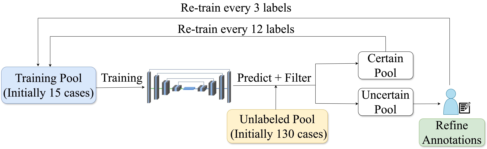
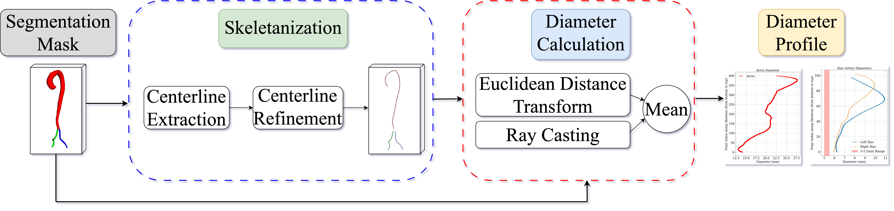
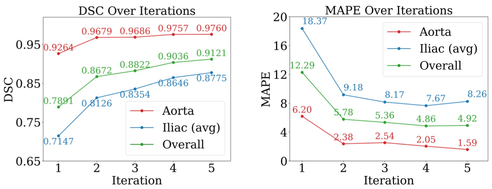
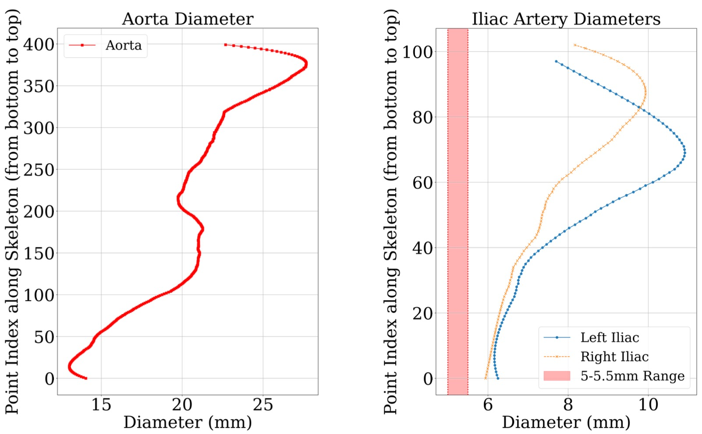

# Aortic Segmentation, Diameter, and Angulation Analysis

This repository provides tools and scripts for automated segmentation and quantitative analysis of the aorta and iliac arteries from medical imaging data (typically NIfTI format). The workflow includes vessel segmentation, post-processing, evaluation, quantitative measurement (diameter/angulation), and active learning with uncertainty-based sample selection.

## Workflow Overview

1. **Segmentation and Prediction**
   - Use a deep learning model (e.g., nnUNet) to segment vessels from medical images.
   - Save the model predictions as `.npz` files.

2. **Post-Processing and Dice Calculation**
   - Apply morphological operations to clean the predictions (`post_processing.py`).
   - Calculate Dice scores for each class (Aorta, Left Iliac, Right Iliac) with `dice.py` to assess segmentation quality.

3. **Quantitative Measurement (Diameter and Angulation)**
   - Use `diameter_cal_prototype.ipynb` to extract vessel skeletons (centerlines) and calculate diameters along the length.
   - Additional notebooks/scripts allow for angulation and other geometric measurements.

4. **Uncertainty-Based Active Learning**
   - Estimate segmentation uncertainty from prediction probabilities using `uncertainty_estimation.py`.
   - Select the most uncertain or informative samples to include in the next iteration of training/data labeling (active learning loop).

## Workflow Diagrams

### Active Learning Pipeline

### Diameter Calculation Pipeline

## Results

### Active Learning Pipeline

### Diameter Calculation Pipeline

## Main Files

- `diameter_cal_prototype.ipynb`: Core notebook for vessel skeletonization and diameter calculation.
- `diameter_comparison_prototype.ipynb`: Compares predicted vs. ground truth diameters, computes evaluation metrics, and generates plots.
- `kinking_v2.ipynb`: Calculates vessel angulation metrics.
- `dice.py`: Computes Dice scores per class and summarizes segmentation quality.
- `post_processing.py`: Cleans predicted segmentation masks using morphological operations.
- `nnunet.scrpt`: SLURM/bash script for nnUNet training, inference, and environment setup.
- `uncertainty_estimation.py`: Calculates uncertainty from probabilistic segmentation outputs for active learning purposes.

## Typical Usage

1. Segment images and save predictions as `.npz`.
2. Post-process predictions and calculate Dice scores.
3. Calculate diameters and other measurements.
4. Use uncertainty files to select best samples for the next iteration (active learning).

## Dependencies

- Python (>=3.7), Jupyter Notebook
- numpy, pandas, nibabel, scikit-image, scipy, matplotlib, torch, tqdm, monai, networkx, skan
---

For details on running each stage, see the code and comments in the corresponding scripts/notebooks. Adjust input/output paths as needed for your data and environment.
